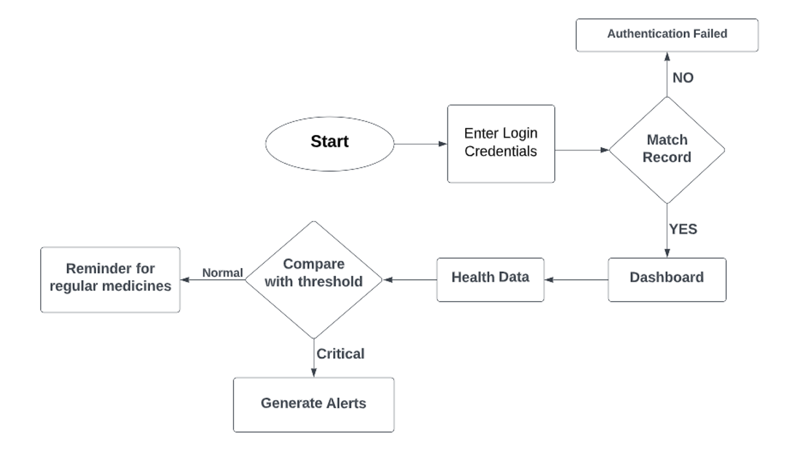
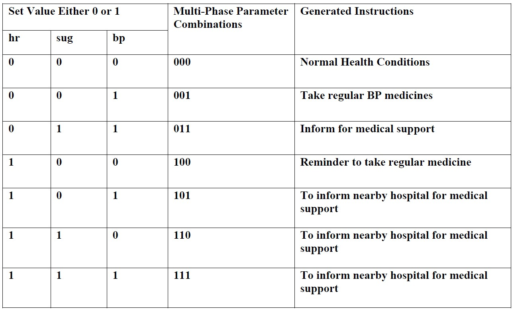

# Smart Health Care System

The Smart Health Care System is an application that takes health data as an input from the authenticated user analyzes the data in the background and generates alerts corresponding to the health condition of the user. For example, if the heart rate or blood pressure goes beyond threshold limit, it will make a call to nearby hospital for medical assistance.

### Process Outline



### Analysis

Data analysis plays a pivotal role in the project, enabling us to extract meaningful insights and make informed decisions.
<br><br>
Process of determining thresholds considering heart rate data from the dataset:

- **Data Filtering:** The dataset is filtered based on specific criteria, such as age and gender, to narrow down the analysis to the relevant subset.

- **Statistical Measures:** Statistical measures, including mean, variance, and standard deviation, is calculated to assess the characteristics and variability of the MaxHR (maximum heart rate) column within the filtered dataset.

- **Threshold Calculation:** The mean value of the MaxHR column serves as the initial heart rate threshold estimate. The variance and standard deviation is considered to account for the spread and variability of the data, ensuring a more comprehensive understanding of the dataset.

### Generating Instructions

The results obtained from data analysis is translated into actionable instructions for users based on their health data input. To achieve this, a code-mapping approach is employed. Utilizing the thresholds determined through the data analysis, specific code mappings are established that signify different health conditions.
<br><br>


### Run the APP Locally

1. Fork this repo [[_learn_](https://docs.github.com/en/get-started/quickstart/fork-a-repo)]
2. Clone the forked repo [[_learn_](https://docs.github.com/en/repositories/creating-and-managing-repositories/cloning-a-repository)]
3. Run the app [*see below*]

Go to the project directory and run the following command from the terminal:

```javascript
npm install && npm start
```

The APP will run on [localhost:3000](http://localhost:3000)

_Note: In order for authentication functionality to work properly, create a `.env` file in the root of project directory and copy your **Firebase** credentials(keys) in it. Look at the [.env.example](/.env.example) file for reference._

## Tech Stacks

<p align="center">
     
     
     
     
     
     
</p>
